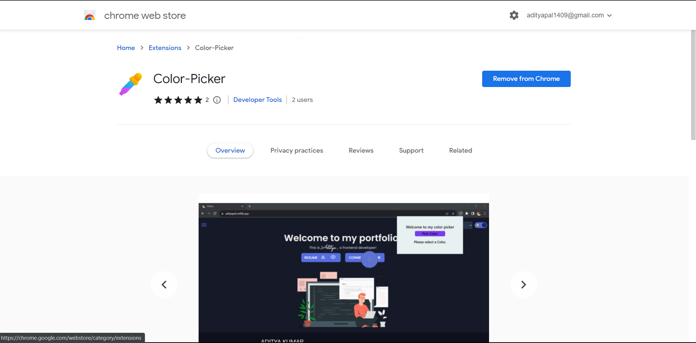

# [Color Picker](https://chrome.google.com/webstore/detail/color-picker/odlceielnakdomibdflildnbfllnjmgk/overview?hl=en-GB&authuser=0)

## 📌Overview

The Color Picker Chrome Extension is a powerful tool that allows you to capture colors from your screen and copy their hex values with a single click. Whether you're a designer, developer, or simply someone who loves colors, this extension streamlines your workflow and enhances your creativity.

## 🙌Features

-   **Capture Colors:** Easily capture colors from your active tab.
-   **Copy Hex Values:** Copy the hex value of the captured color to your clipboard.
-   **Simplified Workflow:** A user-friendly experience that accelerates your color exploration.

## 🛠️Installation

1. Get the Color Picker Extension from the [Chrome Web Store](https://chrome.google.com/webstore/detail/color-picker/odlceielnakdomibdflildnbfllnjmgk/overview?hl=en-GB&authuser=0).
2. Click "Add to Chrome" to install the extension.
3. Access the extension from your browser's toolbar.

## ⚡Usage

1. Click the Color Picker Extension icon in your toolbar to activate the color picker.
2. Hover over any color on your screen and click to capture its hex value.
3. The hex value can be copied to our clipboard by using copy button.

## 🙏Support

If you encounter any issues or have suggestions for improvements, please feel free to [contact us](mailto:adityapal1409@gmail.com).

## ⭐Give Us a Thumbs Up!

If you find the Color Picker Extension useful, please consider giving it a 5-star ⭐⭐⭐⭐⭐ rating on the Chrome Web Store. Your support motivates us to keep improving and providing valuable tools for the community.

[Rate the Extension](https://chrome.google.com/webstore/detail/color-picker/odlceielnakdomibdflildnbfllnjmgk/reviews?hl=en-GB)

Thank you for your support! 🙌🎉
